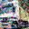

# WEEK3

## 문제 설명
하리(**하**이**리**온)는 오랜만에 추억의 사진을 꺼내보았는데... 맙소사! 사진이 JPG(Jayeon Punghwa Graphic) 포맷으로 돼있어 [디지털 풍화](https://namu.wiki/w/%EB%94%94%EC%A7%80%ED%84%B8%20%ED%92%8D%ED%99%94)가 일어났다. 덕분에 사진 속의 물체가 어떤 것인지 전혀 구분을 할 수 없다. 하리를 도와 사진 속 물체가 무엇인지 확인하는 인공지능을 만들어보자!

## 강의영상
- [Basic CNN](https://www.youtube.com/watch?v=LgFNRIFxuUo&list=PLlMkM4tgfjnJ3I-dbhO9JTw7gNty6o_2m&index=10)
- [Advanced CNN](https://www.youtube.com/watch?v=LgFNRIFxuUo&list=PLlMkM4tgfjnJ3I-dbhO9JTw7gNty6o_2m&index=11)

## Dataset
Dataset은 CIFAR-10을 사용합니다. 하지만 이미지에 임의의 노이즈가 섞여있습니다.  


CIFAR-10은 다음의 코드를 이용하여 받을 수 있습니다.

```python
from torchvision import dataset
from torchvision import transforms

train_dataset = CIFAR10(root='./data', train=True, download=True, 
    transform=transforms.ToTensor())
```

## Data Format 설명
채점에 사용되는 app.py - run 메소드의 input과 output 텐서의 shape는 다음과 같습니다.
- **Input Shape** [batch_size, rgb_channel(3), image_width(32), image_height(32)]
- **Output Shape** [batch_size, num_classes(10)]

*반드시 상기된 형식을 준수해주세요. 형식이 다른 경우 0점 처리됩니다.*

## 채점 기준
- metric은 accuracy를 사용합니다. (app.py의 metric() 메소드 참고)
- accuracy가 0.6 이상이어야 합니다.
